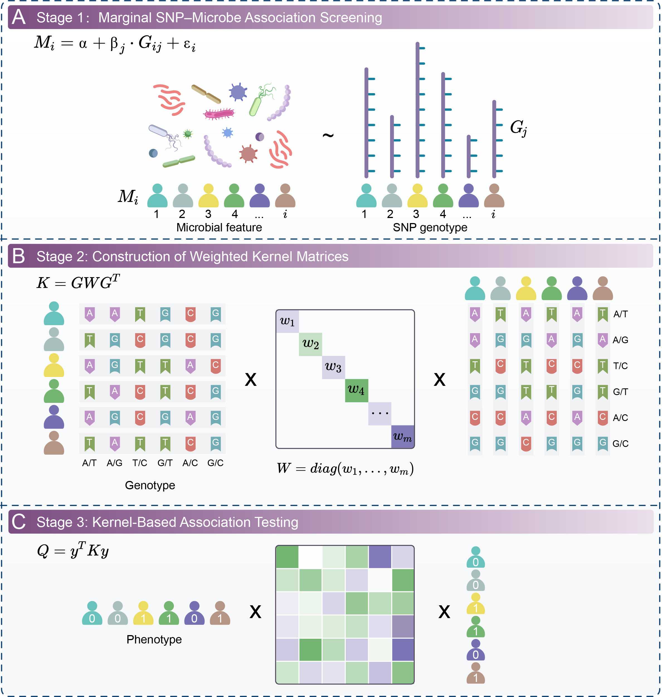

# User Manual of GIMWAS (Version 1.0)
Genetically Imputed Microbiome-Wide Association Study (GIMWAS) is the branded Java command-line tool provided by this repository. The current Java workflow, input arguments, and dependency requirements are preserved; the executable name, CLI entrypoint, user-facing text, and release packaging are standardized around `GIMWAS`.

## Overview of GIMWAS
GIMWAS is packaged as a Java command-line association workflow that consumes genotype and phenotype inputs, a summary information file, and external PLINK/Rscript executables. This repository keeps the existing implementation intact while standardizing the public program surface around `GIMWAS` for distribution and execution.<br><br>
<br>

## Build and Release
Build the release directory from the repository root:

```bash
./build-gimwas.sh
```

This creates:

```text
dist/GIMWAS/
  GIMWAS.jar
  lib/
  EXAMPLE/
  SUMMARY_EXAMPLE/
  README.md
  GIMWAS_Overview.png
```

The generated release directory is the supported way to distribute the tool. `GIMWAS.jar` must stay alongside the generated `lib/` directory.

## Required Software and R Packages
- PLINK v1.9 (https://www.cog-genomics.org/plink/)
- R software (https://www.r-project.org/)
- SKAT >= 2.2.5 (https://cran.r-project.org/web/packages/SKAT/index.html)

## Usage of GIMWAS

```bash
java -jar GIMWAS.jar GIMWAS -format plink|csv -input_genotype path/to/example.tped|example.csv -input_phenotype path/to/example.tfam|example.tsv -input_phenotype_column 6|2 -input_phenotype_type continuous|binary -summary_info path/to/summary_info.txt -microbe Anaerostipes_hadrus_2388_2402 -plink path/to/plink -Rscript path/to/Rscript -output_folder path/to/output_folder
```

## Arguments
- `format`: the format of genotype and phenotype data, `plink` or `csv`.
- `input_genotype`: genotype file.
- `input_phenotype`: phenotype file.
- `input_phenotype_column`: the column of phenotype in the phenotype file.
- `input_phenotype_type`: the type of phenotype, `continuous` or `binary`.
- `summary_info`: summary information file between SNPs and the modeled feature set.
- `micro`: the microbial feature.
- `plink`: PLINK command path.
- `Rscript`: Rscript command path.
- `output_folder`: output directory path.

## Examples

```bash
java -jar GIMWAS.jar GIMWAS -format csv -input_genotype EXAMPLE/csv_format/example.csv -input_phenotype EXAMPLE/csv_format/example.tsv -input_phenotype_column 2 -input_phenotype_type binary -summary_info SUMMARY_EXAMPLE/summary_info_example.txt -microbe Anaerostipes_hadrus_2388_2402 -plink path/to/plink -Rscript path/to/Rscript -output_folder path/to/output_folder
```

```bash
java -jar GIMWAS.jar GIMWAS -format plink -input_genotype EXAMPLE/plink_format/example.tped -input_phenotype EXAMPLE/plink_format/example.tfam -input_phenotype_column 6 -input_phenotype_type binary -summary_info SUMMARY_EXAMPLE/summary_info_example.txt -microbe Anaerostipes_hadrus_2388_2402 -plink path/to/plink -Rscript path/to/Rscript -output_folder path/to/output_folder
```

## Notes
- To stay consistent with PLINK format, the phenotype is set to missing (normally represented by `-9`) if unspecified. It must be numeric.
- Case/control phenotypes are normally coded as control `= 1`, case `= 2`.
- The summary information file requires format conversion.The first column contains microbial features, followed by columns of merged significant SNP information.The segment after the final underscore in each column represents -log₁₀(p-value).
- The association result file written under `path/to/output_folder` is `GIMWAS.result`.


## Citations
If you use the software implementation in analysis, please cite the original manuscript associated with this codebase:<br>
**GIMWAS: A genetically imputed microbiome wide association study reveals nonlinear host-microbiome interactions in renal cell carcinoma, Fei Li, Guoli Xiao, Min Tian, Yulin Yue, Chen Cao.**<br>

## Contacts
Fei Li: lifeiwsy@outlook.com<br>
Chen Cao: caochen@njmu.edu.cn<br>

## License
MIT License.
